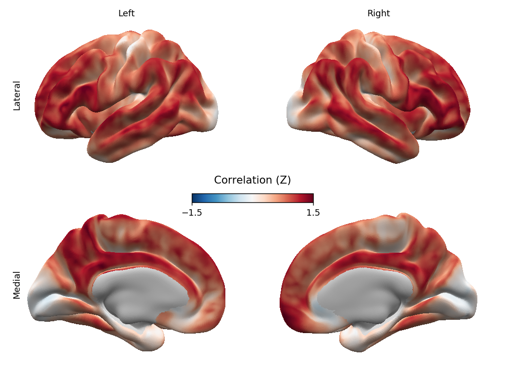

# brain4views
## Plotting 4 brain surface views on a single matplotlib figure

## Dependencies
| python | 3.7.3 |
| --- | -- |
| numpy | 1.16.2 |
| matplotlib | 3.0.3 |
| nilearn| 0.5.2 |

## Sources
* The matplotlib 3D mesh plotter is based on [matplotlib-3d](https://github.com/rougier/matplotlib-3d.git) by [Nicolas P. Rougier](https://github.com/rougier).
* The main function `plot_surf4` is heavily modelled on the `plot_surf` [function in nilearn](https://nilearn.github.io/modules/generated/nilearn.plotting.plot_surf.html).
* [Matplotlib surface plotting](https://github.com/kwagstyl/matplotlib_surface_plotting) by [Konrad Wagstyl](https://github.com/kwagstyl) was an early inspiration.

